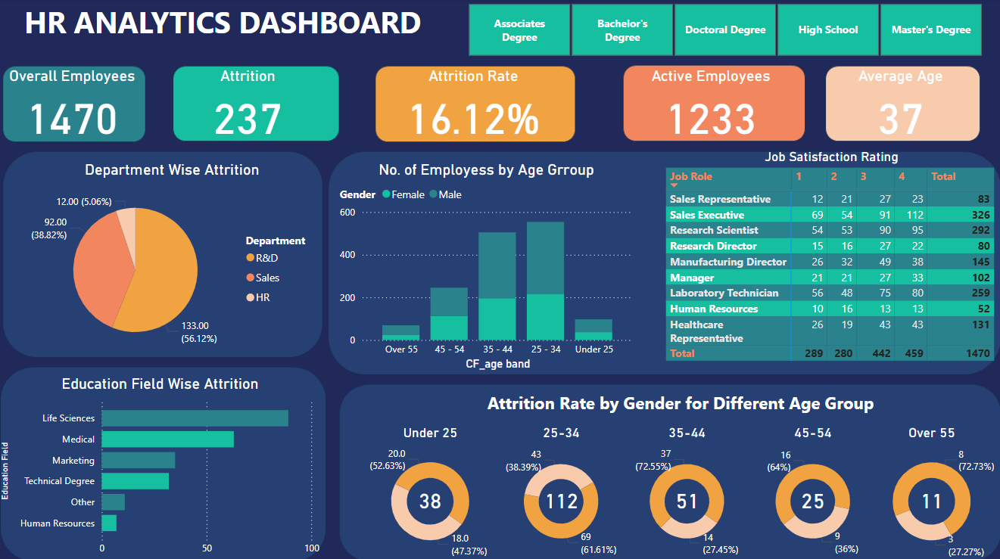

# 📊 HR Analytics Dashboard – Power BI Project

This project features an **interactive HR analytics dashboard** built in **Power BI**, visualizing critical HR metrics like attrition rate, department-wise trends, job satisfaction, and demographics. The dashboard helps HR teams monitor workforce dynamics and make data-driven decisions.

---

## 🎯 Objectives

- Track overall employee count and attrition statistics
- Visualize attrition by **department**, **age group**, and **education field**
- Analyze **job satisfaction ratings** by role
- Build a clean, single-page Power BI dashboard

---

## 🧩 Dashboard Features

- 🔢 **KPIs**: Overall Employees, Attrition Count, Attrition Rate, Active Employees, and Average Age
- 📊 Visuals:
  - Pie chart for **Department-wise Attrition**
  - Bar charts for **Employees by Age Group** and **Education Field Attrition**
  - Table matrix for **Job Satisfaction Rating by Role**
  - Donut charts for **Attrition Rate by Gender across Age Groups**
- 🎛️ Filters: Education Level slicers at the top for dynamic interaction

---

## 🛠️ Tech Stack

| Tool          | Purpose                             |
|---------------|-------------------------------------|
| Power BI      | Data modeling and dashboard design  |
| Power Query   | Data cleaning and transformation    |
| DAX           | Calculated fields and metrics       |

---

## 🖼️ Dashboard Preview

---

## 📌 Key Insights

- **Sales** department has the highest attrition rate.
- Most employees fall in the **25–34** and **35–44** age groups.
- **Job satisfaction** varies across roles, with some departments showing higher satisfaction.
- **Life Sciences** and **Medical** are the top education fields affected by attrition.

---

## 💡 How to Use

1. Download and open `HR_Analytics.pbix` in Power BI Desktop.
2. Interact with the filters and visuals for deeper insights.
3. Use slicers to view data across different education levels.

---

## 🙏 Acknowledgements

- 📊 **Dataset Source**: [HR Analytics Google Sheet Dataset](https://docs.google.com/spreadsheets/d/17zaiJnUOnLdHROWLZYcVlpMJ08wh-Bou/edit?gid=115883679#gid=115883679)
- Dashboard design inspired by standard HR analytics practices and Power BI community dashboards.

